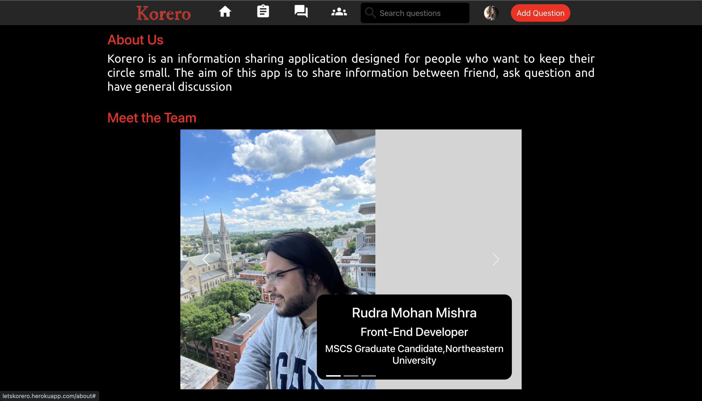
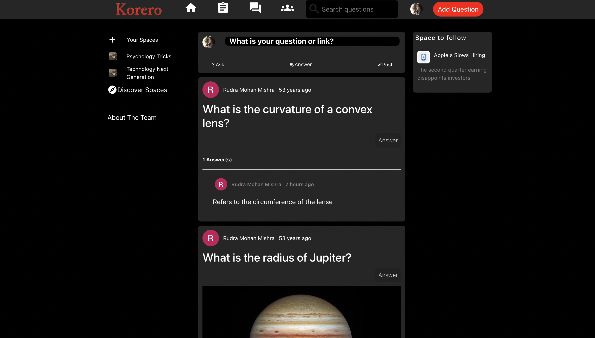
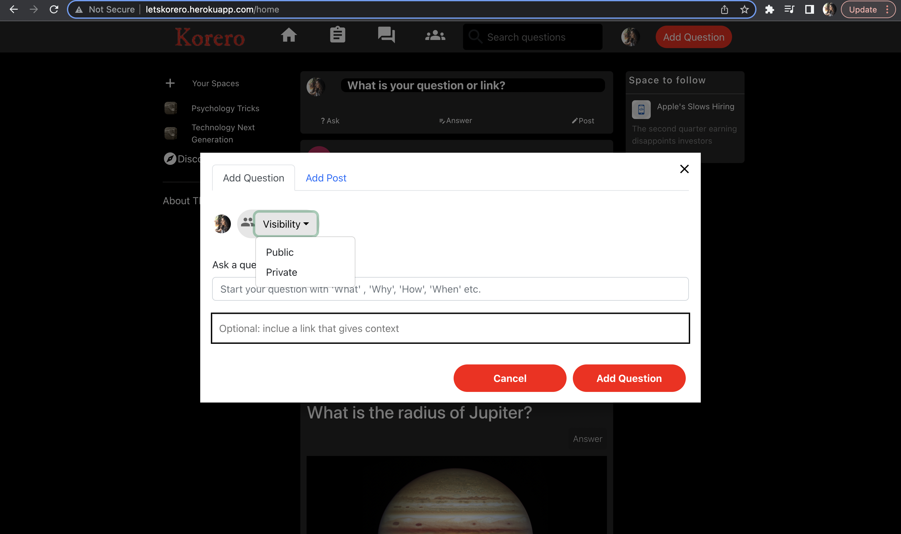
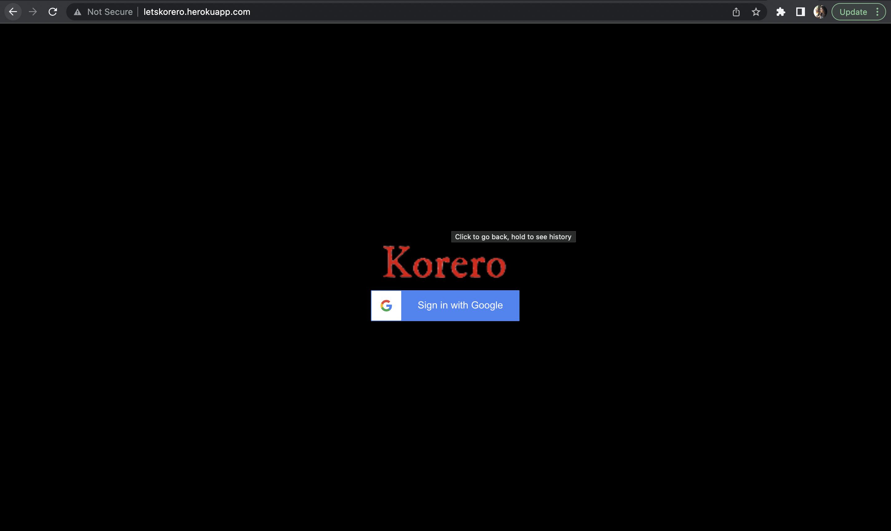
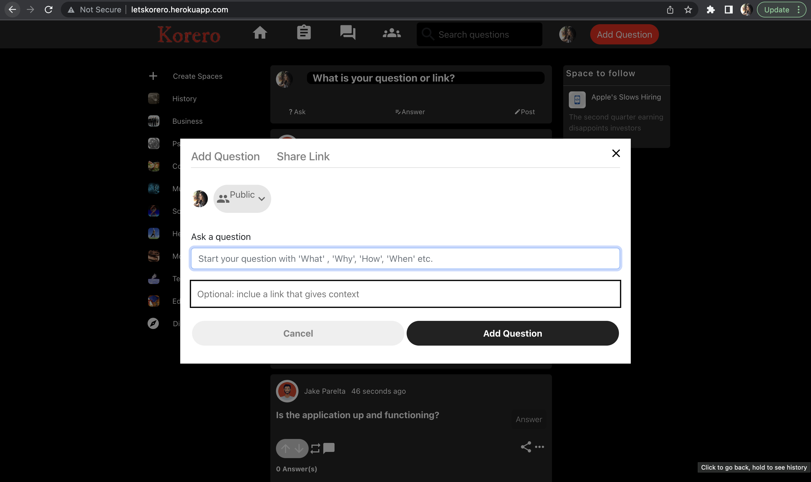
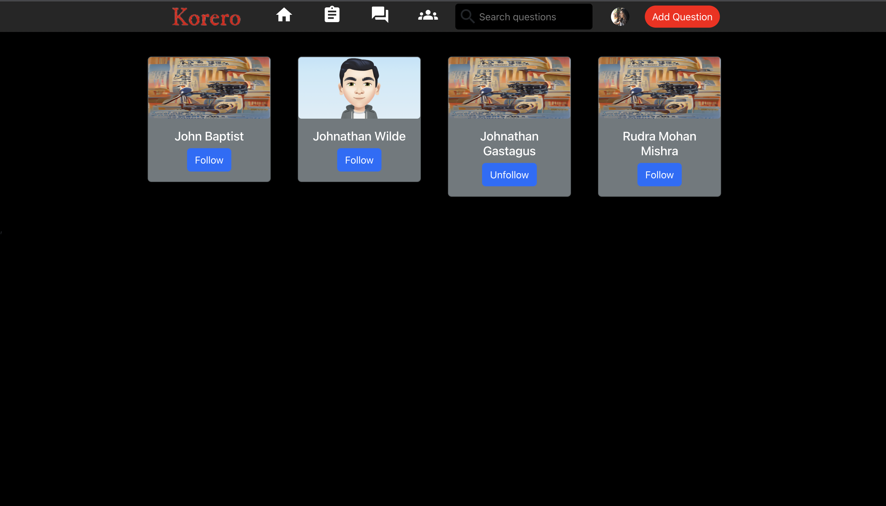
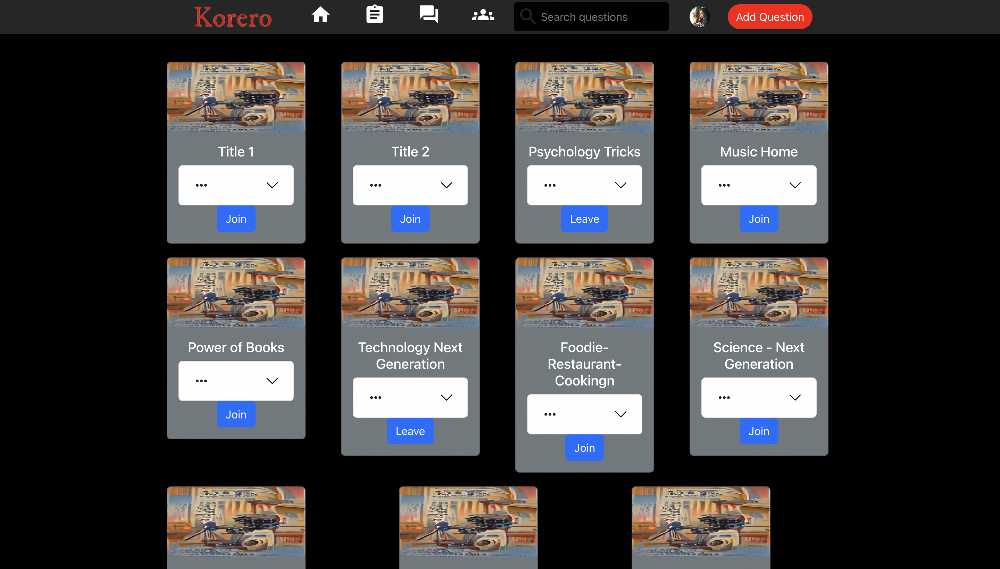
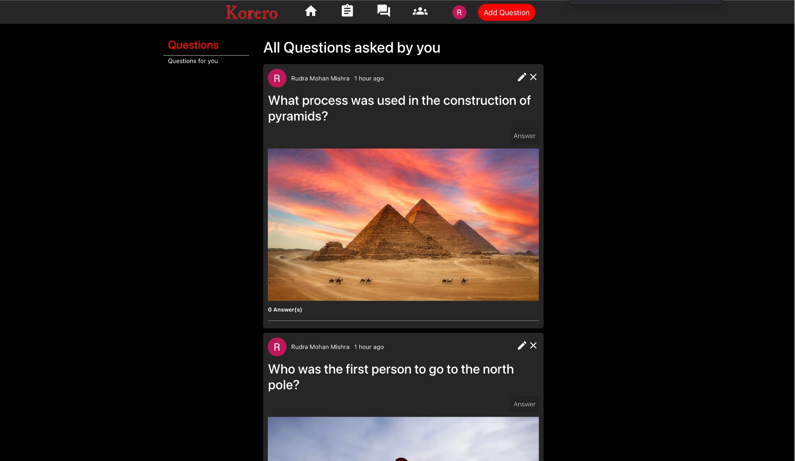

## **TEAM ESPRESSO**
#### **Project Title - KORERO** 
 

### **Description** 
The purpose of our app is for users to post their queries and answer the already exisiting questions. Each of these questions are assigned to a particular category. The users can upvote/downvote an answer or question. They can follow the exisiting people and see more of their answers. The user also has the option to edit or delete his answers on a post or his post completely.

 

### **Requirements** 
 

####
1. **User interface with data by at least 2 CRUD operations (create, read, update, delete) for at least one database table.**

    The project has made use of POST, GET, PUT and DELETE REST APIs which perform the corresponding CRUD operations. The REST APIs have been implemented for each of the collections, namely Users, Questions, Answers, Posts and Spaces. These APIs are used to make changes in the databases. Implementation was done with the help of Insomnia and then once they were working, integrated it 
    with the frontend.

 

#### 
2. **At least 3 different UI routes (appearing to the user as different pages).**
     

    The routes created for the api was - /api/v1/home. This page shows the entire feed which comprises of the questions you have asked, questions people you follow have asked and gives you the option to answer to them. There is also an option to follow spaces which comprise of information pertaining to their fields.
 

    /following - when appended to the original route goes to the following page. This page allows user to follow the people they wish to follow, similar to follow option on any social media app.

    /answer - when appended to the original route goes to the answer page. This page allows user to see all the questions that he has asked and his followers have asked.

    /spaces - when appended to the original route it redirects to the spaces page. The spaces are pages which have information that the page is about. So when the user follows the spaces they will be shown all the posts that have been made in that space.

 

3. #### **At least one Bootstrap UI component not featured in the demo application.**

    The project makes use of the bootstap carousel. In the the Landing page, just below the discover spaces, there is about us link. This goes to the About the Team page. The carousel displays the team members and their education.

 

4. #### **Different layout and design from the demo application; it should not look like an obvious clone.**

    The project looks very different compared to the demo application. The splash screen of the application shows the logo with the google sign option, and then the landing page is divided into three column layout. First colum has the list of spaces that the user is following. The middle column which cover the larger area of the screen is the one which contains the posts and questions. The third column display facts about the spaces and gives the option for the user to follow them. 
    
     

 

 

5. #### **3rd party library for React**
    The project makes use React-Responsive-modal, React-quill and Bootstrap forms and dropdowns for the Add question, add answer modal boxes. 

     

 

## **Frontend of our application**
 

#### **Login page of our application**
 

 

#### **Feed page**
 

 

#### **The user can click on the Add Question button on the top right corner and the following modal opens up.**
 

 

#### **The Following page which allows user to follow other people**

 

 

#### **The Spaces page which allows user to follow spaces to find relevant information**
 

 

#### **The answers page.**
 

 

### Contributions for Iteration -1  
#### Harika Gundala
1. Created the Backend repository in Github with a Backend Skeleton.
2. Adapted the Boiler Plate code for the server side to the needs of the application.
3. Created the logo for the application and documented the README.

#### Lavina Talreja
1. Created the database on MongoDB Atlas.
2. Connected the Database with the Backend code.
3. Deployed the Backend of the application on Heroku.

#### Rudra Mohan Mishra
1. Created the Frontend repository in Github with a Frontend Skeleton.
2. Developed the homepage with a navigation panel and related routes.
3. Integrated third-party library react-responsive-modal and react-quill. Used Material UI for Styling.
4. Deployed the Frontend of the application on Heroku.

### Contributions for Iteration -2 
#### Harika Gundala
1. Created collections in Mongodb Atlas
2. Created the APIs getUser,addUser  and postUser to fetch and manipulate the user collection.
3. Implemented getFeed, addPost, updatePost, deletePost to get the data into the home page based on the user’s following.
4. Implemented the APIs addQuestion, updateQuestion, depeteQuestion, getQuestion, getQuestionByFollowing for the Questions collection. 
5. Created routes for the corresponding apis
6. Populated the collections with data.
7. Documented the README for the project.

 

#### Lavina Talreja
1. Implemented the getAnswer, getAnswerById, postAnswer, updateAnswer and deleteAnswer APIs in the backend for the answers collection.
2. Implemented the addComment, updateComment, deleteComment and getComments APIs for the comments collection.
3. Designed the addSpaces and getSpaces APIs for the spaces collection.
4. Created routes for the corresponding APIs.

 

#### Rudra Mohan Mishra
1. Integrated App with firebase for user authetication using google authentication.
2. Worked on the creation on Usercard and spacecard and populating the Users page and Space page.
3. Integrated the Back-end and Front-end to fetch user data and spaces data and add them to the respective cards.
4. Integrated redux and created a redux store to manage the details of authenticated user.
5. Implemented the create Post  and fetch post API call from front end to backend.
6. Worked on improving the CSS styling to give a more uniform theme to the site.
7. Implemented the getAllUser API in the Back-end to fetch all users from the user collection in the db.
8. Implemented carousel to design the about us page.

### Contributions for Iteration -3
#### Harika Gundala
1. Tried to implement the Github and Facebook User authentication using Firebase for the front-end of the application.
2. Tested the application for bugs and checked for irregularities. 
3. Documented the README for the project.

 

#### Lavina Talreja
1. Populated the collections with realistic data.
2. Tested the application to identify bugs.

 

#### Rudra Mohan Mishra
1. Used react-responsive-modal , dropdown , react-quill to design the add post /question modal
2. Integrated the updated user, addPost , updatePost , deletePost API with the front end
3. Integrated the follow user and join spaces API
4. Updated the CSS of various components to achieve a uniform look.
5. Deployed both Front-end and Back-end to heroku.
6. Integrated API to display questions in the answer page. The answer page displays all question a user has asked and all the public questions of the people the user follows

